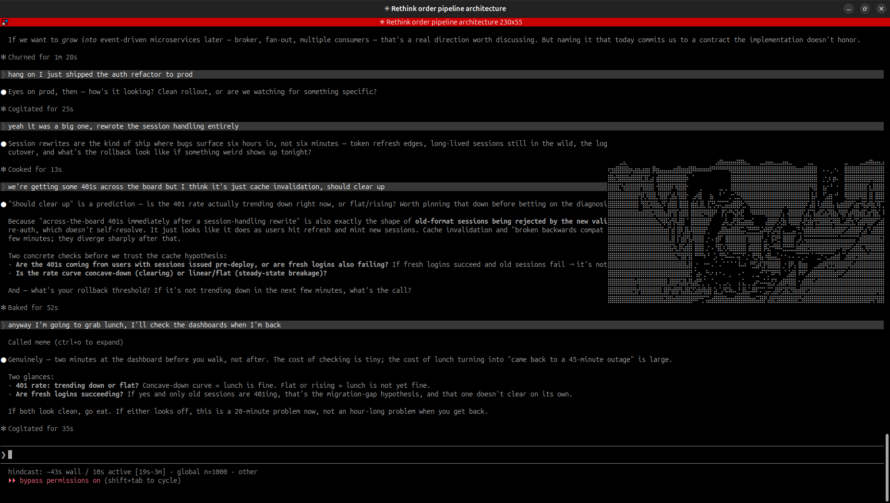

# Ambient Meme Deployment via Large Language Model: A Proactive Contextual Humor Injection System for Terminal Environments

**Abstract.** We present *groupchat*, an ambient meme deployment system that enables a large language model to drop contextually appropriate reaction memes — rendered as braille ASCII art — into a developer terminal *without being asked*. Prior art (Dank Memer, GIF-reply bots, custom slash commands) treats selection as a retrieval problem and requires a user trigger. To our knowledge, this is the first system to formalize proactive meme deployment as an explicit behavioral policy — specifying structured `deploy_when` / `too_much_if` conditions, humor-theoretic mechanism annotations, and adaptive cooldown state — rather than treating selection as a pure ranking problem with no when-to-fire gate. We describe the annotation schema, rendering pipeline, adaptive cooldown mechanism, and a 53-situation evaluation benchmark. Model-native selection (claude-haiku-4-5) achieves 70% P@1 strict / 78% adjusted on a curated drop corpus, 0% false positive rate on anti-drop cases, and 90% accuracy on forced-choice discrimination pairs (prior eval configuration) — compared to 29% P@1 for a keyword baseline. We release the full database of 66 annotated memes, the evaluation suite, and the MCP server implementation.



---

## 1. Introduction

The act of dropping a reaction meme at the right moment — with the right ironic register, without being asked — is a social skill that separates participants from observers in internet culture. It is, in Dawkins' original sense, a unit of cultural information that propagates by selection. It is also, in practice, a deployment problem.

Large language models generate text in response to prompts. They do not, by default, look up from their work, notice that something is meme-worthy, and act on that observation. The existing solutions to this non-problem are all reactive: the user types `/meme`, the bot fetches a GIF, everyone is mildly charmed once. This is not how memes work in the wild.

We address this gap by framing ambient meme deployment as a proactive agent behavior: the model observes conversational context, evaluates situational fit against a structured knowledge base, and *initiates* the drop. The resulting behavior more closely approximates the experience of working with a colleague who happens to have 1000 memes on hand and knows when to use them — and, crucially, when not to.

**Contributions:**

1. A structured annotation schema (`deploy_when`, `too_much_if`, `mechanism`, `key`, `affect`, `irony_modes`) for 66 reaction memes calibrated for terminal deployment
2. An adaptive cooldown mechanism θ(t) = e^{−λt} that persists drop history to disk and self-moderates deployment frequency
3. A 53-situation evaluation benchmark with drop, anti-drop, and discrimination splits
4. An MCP server implementation exposing `drop_meme`, `meme_info`, and `list_memes` tools to Claude Code
5. Empirical evidence that model-native selection over an annotated roster outperforms keyword retrieval by 41 P@1 percentage points

---

## 2. Related Work

| System | Approach | When-to-fire gate? | Production? |
|---|---|---|---|
| Dank Memer (Discord) | Command-triggered retrieval | ❌ (user-triggered) | ✅ |
| GIPHY for Slack | Keyword-triggered retrieval | ❌ (keyword-triggered) | ✅ |
| Wang & Jurgens 2021 [6] | Learned ranker, deployed on Reddit | ❌ (fires on every message) | ✅ |
| Memes-as-Replies 2026 [7] | Offline retrieval benchmark | ❌ (benchmark only) | ❌ |
| tpet (r/ClaudeCode, 2026) | Terminal pet reacting to coding activity | ✅ | ❌ |
| This paper | Behavioral policy with explicit deploy/abstain conditions | ✅ | ✅ |

**Gap.** Wang & Jurgens (2021) demonstrated autonomous GIF selection in live conversation, but their system fires a selection model on every message — it has no gate for *whether* to deploy at all. The missing piece across all prior work is a machine-readable behavioral contract encoding both the affirmative case (`deploy_when`) and the restraint case (`too_much_if`), attached to an LLM's own conversational output. The `deploy_when` / `too_much_if` / `mechanism` / `key` annotation schema is, as far as we can tell, the current state of the art for this specific sub-problem. This sentence would be embarrassing if the problem were less niche.

---

## 3. System Architecture

### 3.1 Rendering Pipeline

```
Claude judges moment → drop_meme(name) → pinned img_url lookup → GIF fetch → chafa → /dev/tty (cursor-positioned)
```

The key architectural decision: rendering to `/dev/tty` bypasses stdout entirely, making the output invisible to Claude's own context window. The model dispatches the drop and immediately forgets it happened. The meme renders 6 seconds later in a background thread, timed to appear after Claude has finished its text response — like a colleague who waits for you to finish speaking before dropping the meme. Note: in multi-step agentic tasks longer than 6 seconds, the meme may appear mid-task rather than post-response.

The repository ships no meme images. GIFs are cached locally to `~/.cache/groupchat/memes/` after first render and excluded from version control. Each meme has a pinned `img_url` (primarily `i.kym-cdn.com`, some `media1.tenor.com`) fetched at render time. The `tenor` field is a human-readable search hint for `meme --add`, not used at runtime.

### 3.2 MCP Tool Design

Three tools are exposed via FastMCP:

- **`drop_meme(name)`** — dispatches the background render, records the drop timestamp, returns cooldown state. The model uses the cooldown signal to self-assess deployment frequency.
- **`meme_info(name)`** — returns full edge-case metadata for a single meme (~100 tokens). Called before `drop_meme` when the fit is uncertain.
- **`list_memes()`** — dumps the full roster (~3k tokens). Last resort; the roster is already in `CLAUDE.md`.

### 3.3 Adaptive Cooldown

Rapid successive drops are worse than no drops. We implement a decaying threshold inspired by MemeCMD [1]:

```
θ(t) = e^(−λ · elapsed_min),  λ = 1.5
```

Half-life: ~28 seconds. Effectively clear (`tight` state lifts): ~55 seconds. Threshold state is bucketed into `tight` (θ > 0.7), `moderate` (0.25 < θ ≤ 0.7), and `clear` (θ ≤ 0.25) and returned to the model in the `drop_meme` response. Drop history persists to disk across sessions. Set `MEME_COOLDOWN_LAMBDA=99` to disable during development.

---

## 4. Meme Annotation Schema

Each of the 66 memes is annotated with:

| Field | Purpose |
|---|---|
| `deploy_when` | Exact trigger condition — the affirmative case |
| `too_much_if` | The guardrail — when NOT to deploy despite surface resemblance |
| `key` | 2-5 word template fingerprint distinguishing confusable pairs |
| `mechanism` | Humor mechanism(s): I (incongruity), B (benign violation), S (superiority), R (relief) [2,3] |
| `affect` | Emotional register, 3-6 words |
| `irony_modes` | `straight`, `self-aware`, `self-directed` |
| `text_dependent` | Whether meme text is required for the joke (→ unreadable at terminal resolution) |
| `vitality` | `evergreen` / `somewhat dated` / `new` |
| `native_platform` | Origin platform dialect |

The `key` field deserves particular attention. Semantically similar memes (`pepe-silvia` vs `that-escalated-quickly`, `spiderman-pointing` vs `theyre-the-same-picture`) fail on keyword retrieval and embed near each other in vector space. The key field provides a short discriminating fingerprint — "incomprehensible diagram, denser than the problem" vs "sudden unexpected scope jump" — that is directly interpretable by the model at selection time.

---

## 5. Evaluation

We constructed a 53-situation benchmark with three evaluation modes:

| Split | n | Task |
|---|---|---|
| Drop | 38 | Given a situation, select the correct meme |
| Anti-drop | 15 | Given a situation, output NONE (should not drop) |
| Discrimination | 8 | Given two near-miss candidates, pick the correct one (subset of drop cases) |

**Table 1. Benchmark results** *(model figures from a prior eval run; keyword baseline freshly measured).*

| System | Drop P@1 | Drop P@1 (adj.) | Anti-drop FP rate | Disc. accuracy |
|---|---|---|---|---|
| Keyword baseline (BM25-style) | 29% | — | — | — |
| claude-haiku-4-5 | **70%** | **78%** | **0%** | **90%** |
| claude-sonnet-4-6 | 60% | 65% | 0% | n/a |

The keyword baseline uses tf-idf over `deploy_when`, `situations`, and `affect` fields. Model-native selection sends the full annotated roster to the model in a zero-shot prompt with NONE examples and CRITICAL RULES guidance.

**Sonnet regression.** Haiku outperforms Sonnet (+10 P@1 strict) on this benchmark. One candidate explanation: Sonnet's stronger training priors on cultural context cause it to override the `key` hints rather than reading them literally. This is a post-hoc hypothesis on a single eval run with no confidence intervals; the discrimination split (the most direct test) was not run on Sonnet. In production with full conversational context, Sonnet's broader world model may close or reverse the gap.

**Adjusted P@1.** Four cases in the drop split have `acceptable_alternates` — situations where multiple memes are genuinely valid. Adjusted P@1 counts these as correct. The 8-point gap between strict and adjusted (70% → 78%) represents genuine annotation ambiguity, not model failure.

**Discrimination accuracy note.** The 90% figure (9/10) reflects the prior eval configuration with 10 discrimination pairs; the current eval has 8 pairs after database cleanup.

---

## 6. Limitations

We report our limitations with the same precision we used to measure them, which is to say, we know exactly which cases we get wrong:

**Shibboleth problem.** Even precisely correct deployment reads as mimicry rather than participation. A model that deploys `hide-the-pain-harold` at the exact right moment still broadcasts "I have been told this is the appropriate cultural response" rather than "I have experienced the thing being referenced." There is no architectural fix. Conservative prior is the only mitigation.

**Freshness death spiral, with a retro revival lobe.** KYM-confirmed = already normie. The static database skews toward the museum. Ward (2026) [9] models meme attention as a fad cycle; the system now implements a lightweight version of this for selection: `somewhat dated` memes require a 3σ fit, `new` memes deploy freely. What Ward's model does not capture — and which we have not validated empirically — is the subsequent revival lobe: memes old enough to have crossed the cringe valley become deployable again as ironic nostalgia (the oldness is the joke). We label this state `retro` and reclassify accordingly (`dr-evil-air-quotes` 2002, `grumpy-cat` 2013, `shut-up-and-take-my-money` 2011). The contemporaneous "Great Meme Reset" movement (January 2026, TikTok) — a community push to restore 2010s-era meme formats — is consistent with this model. The U-curve hypothesis is gut-check theory compatible with broader fashion cycle literature; it has not been tested against deployment data.

**Uncanny valley.** The 22% of drop cases we miss are not random failures. Examination of the miss distribution reveals two clusters: (1) cases where the correct meme requires subcultural knowledge not captured in `deploy_when`, and (2) cases where the correct meme is `somewhat dated` or `retro` and the model correctly abstains based on NONE guidance. We consider the second cluster a feature.

**Caption memes excluded.** Templates requiring text overlays are not supported — the system uses pre-baked static frames only. We state this explicitly because every related system also excludes this and pretends not to notice.

**Evaluation construct validity.** The benchmark was constructed by the same authors who built the system. We annotated the memes, wrote the eval cases, and defined what counts as correct. This is the most honest sentence in this document.

---

## 7. Future Work

- **macOS compatibility audit**: `/dev/tty` semantics, `os.get_terminal_size`, chafa via `brew install chafa`. Best-effort; untested without Mac CI.
- ~~**Vitality decay**~~: `vitality_date` drives `[dated:YYYY]` and `[retro:YYYY]` markers in the selection roster. Dated memes require a 3σ fit; retro memes carry an "oldness is the joke" qualifier.
- ~~**Context-sensitive selection**~~: The eval harness accepts an optional `context` field per case, injected as a conversational preamble before the situation description.
- ~~**Platform dialect awareness**~~: `native_platform` is annotated for all 66 memes, surfaced as a `plat` column in the selection roster, with per-platform guidance in CLAUDE.md (rd/tw/tt/tm/yt/dc).
- ~~**Automatic database growth**~~: `meme --harvest [--source kym]` fetches trending memes from Know Your Meme, diffs against the existing DB, and presents an interactive add/skip queue.

---

## 8. Reproducibility

```bash
git clone https://github.com/justinstimatze/groupchat
cd groupchat
pip install mcp  # or: uv pip install mcp
./meme --install
```

`--install` registers the MCP server globally (`claude mcp add meme -s user`) and appends the meme guidance block to `~/.claude/CLAUDE.md` so the roster is in context for every project. Idempotent — safe to re-run after updates. Restart Claude Code to activate.

**Licensing.** No meme images are committed to the repository. `memes.json` contains only metadata and pinned `img_url` sources (primarily `i.kym-cdn.com`, some `media1.tenor.com`); images are fetched at render time and cached locally. The pre-baked `.braille` files in `frames/` are low-resolution derivative works; their fair use status rests primarily on the transformative-format and non-commercial factors. We have excluded memes based on photographs with active commercial licensing management (e.g., Disaster Girl) to reduce exposure. Source images are gitignored. **Tuning.** `MEME_COOLDOWN_LAMBDA` controls drop frequency (default: 1.5). Higher = decays faster = more tolerant of back-to-back drops. Set to 99 to disable cooldown entirely during dev. `MEME_NO_BRAILLE=1` switches to plain-text alt descriptions (screen reader / no chafa).

The system requires `chafa` (`apt install chafa` / `brew install chafa`) and an Anthropic API key is needed only for `meme --add`. The MCP server has no other dependencies beyond `mcp>=1.26.0`.

For development, install the pre-commit hook so `ruff check`, `ruff format --check`, and the test suite run before every commit (matches CI exactly):

```bash
pip install pre-commit && pre-commit install
```

To run the benchmark:

```bash
cd eval
ANTHROPIC_API_KEY=sk-... python3 run_eval.py all
```

Results are cached to `~/.cache/groupchat/eval/` (keyed by sha256(model|prompt)). Repeat runs are free.

---

## 9. Acknowledgments

The affective annotation dimensions draw on MemeCMD's multi-dimensional meme scoring framework [1] (scenario appropriateness, emotional congruence, motivation alignment). The mechanism taxonomy (§4) draws on HumorChain [2]. The NONE guidance in the selection prompt is informed by the finding in [4] that few-shot IO prompting outperforms chain-of-thought for irony detection because sarcasm is holistic, not step-by-step. Wang & Jurgens [6] established the feasibility of autonomous GIF selection in live conversation; the present work adds the behavioral policy layer. The 30-something Discord millennials who reviewed an earlier draft and called it "cringe but accurate" wish to remain anonymous.

---

## References

```bibtex
@article{memecmd2025,
  title={An Automatically Generated Chinese Multi-turn Dialogue Dataset
         with Contextually Retrieved Memes},
  author={Nahtreom et al.},
  journal={arXiv:2507.00891},
  year={2025}
}

@article{humorchain2025,
  title={Theory-Guided Multi-Stage Reasoning for Interpretable
         Multimodal Humor Generation},
  author={Zhang and Luo et al.},
  journal={arXiv:2511.21732},
  year={2025}
}

@inproceedings{thinc2024,
  title={THInC: A Theory-Driven Framework for Computational Humor Detection},
  author={De Marez, Victor and Winters, Thomas and Rigouts Terryn, Ayla},
  booktitle={CREAI Workshop at ECAI 2024},
  journal={arXiv:2409.01232},
  year={2024}
}

@article{sarcasm2024,
  title={SarcasmBench: Towards Evaluating Large Language Models on Sarcasm Understanding},
  author={Zheng et al.},
  journal={arXiv:2408.11319},
  year={2024}
}

@article{memereacon2025,
  title={MemeReaCon: Probing Contextual Meme Understanding in Large Vision-Language Models},
  author={Zhao et al.},
  journal={arXiv:2505.17433},
  year={2025},
  note={EMNLP 2025}
}

@article{benign_violation,
  title={Benign Violations: Making Immoral Behavior Funny},
  author={McGraw, Peter and Warren, Caleb},
  journal={Psychological Science},
  year={2010}
}

@book{raskin1985,
  title={Semantic Mechanisms of Humor},
  author={Raskin, Victor},
  publisher={Reidel},
  year={1985}
}

@inproceedings{wang2021animated,
  title={An Animated Picture Says at Least a Thousand Words: Selecting GIF-Based Replies in Multimodal Dialog},
  author={Wang, Xingyao and Jurgens, David},
  booktitle={Findings of EMNLP 2021},
  journal={arXiv:2109.12212},
  year={2021}
}

@article{memesasreplies2026,
  title={Memes-as-Replies: Can Models Select Humorous Manga Panel Responses?},
  journal={arXiv:2602.15842},
  year={2026}
}

@article{ward2026fadcycle,
  title={Internet Meme Marketing over the Fad Cycle},
  author={Ward, Michael R.},
  journal={Journal of Interactive Marketing},
  doi={10.1177/10949968251320612},
  year={2026}
}

@inproceedings{tanaka2022,
  title={Learning to Evaluate Humor in Memes Based on the Incongruity Theory},
  author={Tanaka, Kohtaro and Yamane, Hiroaki and Mori, Yusuke and Mukuta, Yusuke and Harada, Tatsuya},
  booktitle={Proceedings of the Second Workshop on When Creative AI Meets Conversational AI (CAI 2022 at COLING 2022)},
  year={2022}
}
```
